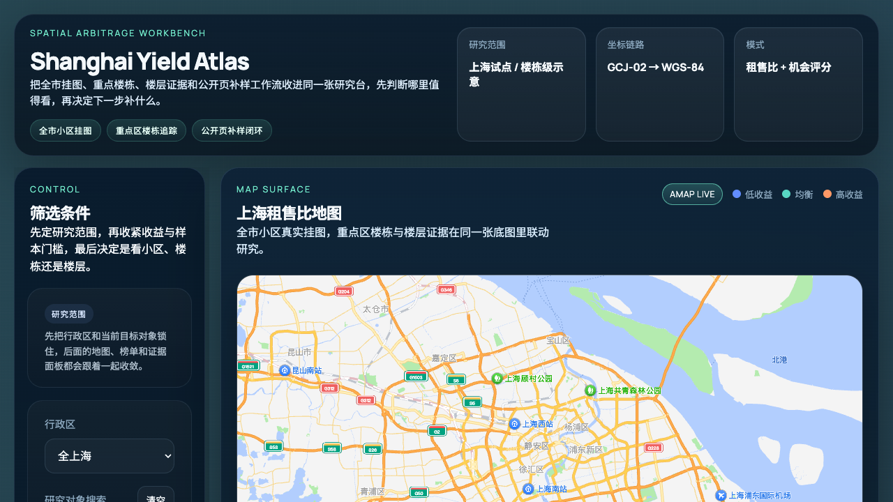

# Yieldwise · 租知

[](https://github.com/Leonard-Don/yieldwise/actions/workflows/validate.yml)
[](LICENSE)

**Open-source workbench for analyzing rental-yield data across Chinese cities — drop in your own CSVs, see them on a map, compute yield / payback / occupancy KPIs.**

[中文 README](README.zh.md) · [Live demo](#quick-start) · [How it's built](docs/internal/legacy-runbook.md)

<p align="center">
  
</p>

## What is this

Yieldwise is a personal-scale real-estate analysis tool. You upload your own CSV files of properties you care about and Yieldwise:

- Plots them on a map alongside open-data communities and OSM building footprints
- Computes rental yield / payback / occupancy KPIs per district / community / building
- Lets you compare your candidates against the local market in seconds

**Run it locally on your machine. Your data never leaves it.**

## Who is this for

- **Individual investors** who want to look at rental yield distributions across districts before bidding on a property
- **FinTech / urban-economics / real-estate finance students and researchers** who need a quick analytical scaffolding for coursework or research
- **Tinkerers** who want to see what a "Bloomberg terminal for Chinese rentals" might look like as an open-source side project

## Why it exists

Public real-estate data in China is scattered across government open-data portals, OSM, AMAP POIs, and PDF reports priced for institutions. Yieldwise stitches the open-source bits into one place and gives you a CSV import lane for the rest.

No scraping, no compliance grey area — you bring authorized data, the tool helps you analyze it.

## Quick start

Prerequisites: Python 3.13+ and a local Postgres + PostGIS instance. [Postgres.app](https://postgresapp.com/) is the lightest option on macOS and bundles PostGIS.

```bash
git clone https://github.com/Leonard-Don/yieldwise.git
cd yieldwise
cp .env.example .env             # edit .env to set AMAP_API_KEY (free, see below)

python3 -m venv .venv && source .venv/bin/activate
pip install -r api/requirements.txt

createdb yieldwise                                                # one-time
psql yieldwise -c "CREATE EXTENSION IF NOT EXISTS postgis"        # one-time

export $(grep -v '^#' .env | xargs)
uvicorn api.main:app --reload --port 8000
```

Open `http://localhost:8000` and log in with the credentials in `.env` (default `admin` / `changeme-after-first-login`).

Try the customer-data upload at `/admin/customer-data`:
1. Click 下载模板 → save `portfolio.csv`
2. Fill in 5–10 rows with your sample data
3. Upload — the map populates with your points

The schema (both core tables and the customer-data domain) is applied automatically on first DB use, so no manual `psql -f` is needed.

Need a free AMAP key for the map to render? Get one at [lbs.amap.com](https://lbs.amap.com/api/javascript-api-v2/prerequisites). Personal keys are fine for solo use; commercial deployments need a commercial key.

CSV template: `/api/v2/customer-data/templates/portfolio.csv` — see [docs/customer-data-csv-spec.md](docs/customer-data-csv-spec.md).

## Features

- **Three workflows on one map**: 收益猎手 (yield hunter) · 自住找房 (homebuyer) · 全市观察 (city overview)
- **`portfolio` CSV import** — drop in the properties you're tracking and they appear on the map
- **OSM + AMAP merged building footprints** with quota-based community matching
- **Per-row error capture** in CSV imports — bad rows go to an `errors.json` audit trail, never block the whole batch
- **Staged-first storage** — every import lands in `tmp/customer-data-runs/<run_id>/` for review before persisting to Postgres

## Data sources (transparency)

| Layer | Source | License |
|---|---|---|
| Building footprints | OpenStreetMap | ODbL |
| Community boundaries | AMAP POI (commercial key required for production) | Per AMAP ToS |
| District boundaries | Shanghai government open data | Open Government Data |
| Listings (sample) | Synthetic / hand-curated demo set | Self-generated |
| Customer data | **Brought by user (CSV)** | Owned by user |

Yieldwise ships **zero scrapers** and never auto-fetches anything that requires authorization. If a data source needs scraping, that's your decision in your own environment.

## Project status

**v0.3** (April 2026) — Beta. Stable:
- Auth + portfolio CSV import + staged-first persist
- Shanghai live (city manifest is YAML-based — drop in another `<city>.yaml` to extend)
- ~250 backend tests + ~110 frontend node tests
- Maintained part-time — expect rough edges, file issues if you hit them

**Not yet shipped** — see [GitHub Issues](https://github.com/Leonard-Don/yieldwise/issues):
- Address-only geocoding (currently requires explicit lng/lat in CSV)

## Contributing

Issues, ideas, and PRs welcome. See [CONTRIBUTING.md](CONTRIBUTING.md).

## License

MIT — see [LICENSE](LICENSE). The MIT grant covers Yieldwise's source code only; data sources retain their own licenses (OSM ODbL, AMAP ToS, etc.).

## Contact

For questions, feedback, or bug reports, please use [GitHub Issues](https://github.com/Leonard-Don/yieldwise/issues) or [Discussions](https://github.com/Leonard-Don/yieldwise/discussions).

If you find this useful, a star on the repo helps a lot.
